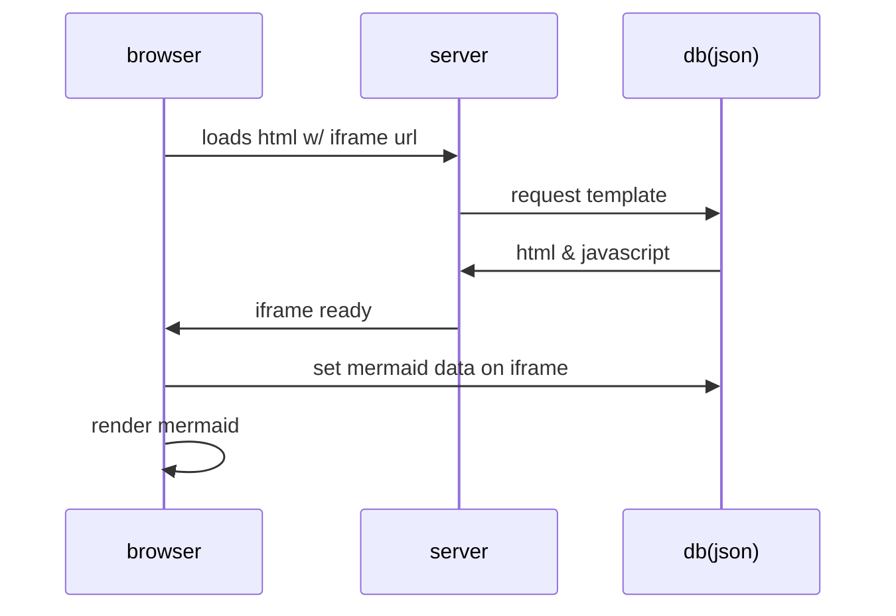

```mermaid
sequenceDiagram
    participant browser
    participant server
    participant db(json)
    browser->>server: loads html w/ iframe url
    server->>db(json): request template
    db(json)->>server: html & javascript
    server->>browser: iframe ready
    browser->>db(json): set mermaid data on iframe
    browser->>browser: render mermaid
```
