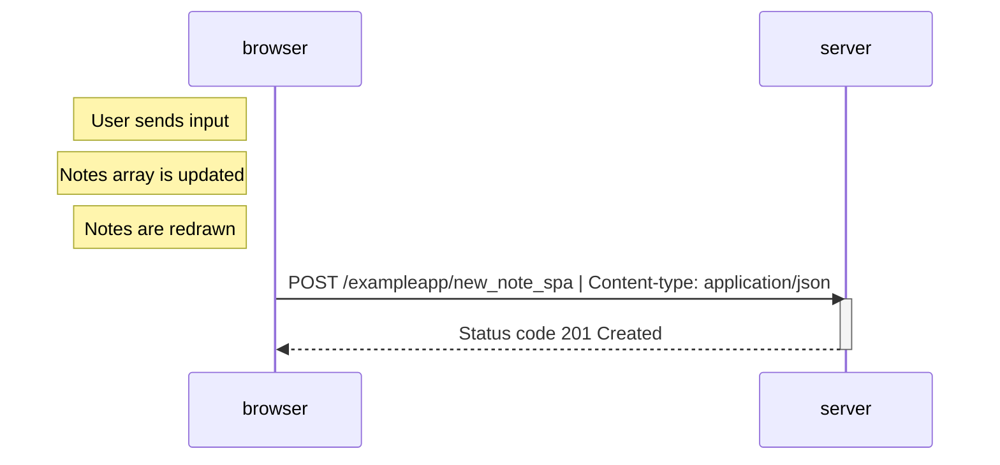

```mermaid
sequenceDiagram
    participant browser
    participant server

    Note left of browser: User sends input
    Note left of browser: Notes array is updated
    Note left of browser: Notes are redrawn

    browser->>server: POST /exampleapp/new_note_spa | Content-type: application/json
    activate server
    server-->>browser: Status code 201 Created
    deactivate server
```
